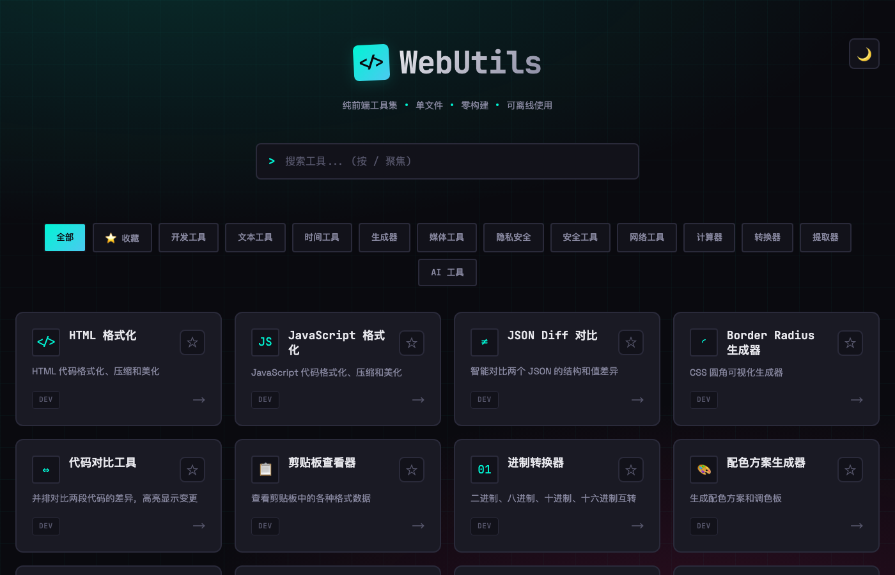

# WebUtils

[简体中文](README.md) | [English](README.en.md)

> 1,088+ open-source browser tools. Static-first, privacy-conscious, offline-ready, and portable as standalone HTML.

[Use WebUtils online](https://tools.realtime-ai.chat) · [Browse all tools](https://tools.realtime-ai.chat) · [Contribute](CONTRIBUTING.md)



## Why WebUtils?

WebUtils is a large collection of focused utilities for developers, writers, designers, and everyday workflows. Most formatting, encoding, calculating, and generation tasks run inside the current browser page. No account is required, there are no ads, and the site does not include first-party analytics scripts.

The project is designed around four practical promises:

- **Local-first processing:** suitable tools keep their input in the browser.
- **Transparent network boundaries:** tools that need an API or external resource identify that dependency instead of claiming universal offline behavior.
- **Portable tools:** registered pages can be exported with repository-owned shared CSS and JavaScript inlined into a standalone HTML file.
- **Auditable maintenance:** metadata, generated indexes, tests, lint rules, browser smoke checks, and release artifacts are validated in CI.

## Featured tools

| Tool                                                                                      | What it does                                             |
| ----------------------------------------------------------------------------------------- | -------------------------------------------------------- |
| [JSON Formatter](https://tools.realtime-ai.chat/tools/dev/json-formatter.html)            | Format, minify, validate, sort, and inspect JSON locally |
| [Timestamp Converter](https://tools.realtime-ai.chat/tools/time/timestamp.html)           | Convert Unix timestamps and local date-time values       |
| [URL Codec](https://tools.realtime-ai.chat/tools/dev/url-codec.html)                      | Encode, decode, and inspect URL components               |
| [Base64 Codec](https://tools.realtime-ai.chat/tools/dev/base64.html)                      | Encode and decode Unicode text or local files            |
| [QR Code Generator](https://tools.realtime-ai.chat/tools/generator/qrcode-generator.html) | Generate customizable QR codes in the browser            |
| [Image Compressor](https://tools.realtime-ai.chat/tools/media/image-compressor.html)      | Compress images locally with visual controls             |

Explore all 35 categories through [the live tool index](https://tools.realtime-ai.chat).

## Privacy and network boundaries

“Browser-based” does not automatically mean “never connects to the network.” WebUtils documents the distinction:

| Tool type                 | Typical behavior                                         | Offline expectation                                   |
| ------------------------- | -------------------------------------------------------- | ----------------------------------------------------- |
| Local computation         | Input is processed in the current page                   | Works offline when required assets are available      |
| Browser capability        | Uses APIs such as Clipboard, File, Camera, or Web Crypto | Depends on browser support and permissions            |
| Network client            | Sends a request to a user-selected or documented service | Requires network access                               |
| External resource or data | Loads a CDN asset, image, font, or public API            | May expose ordinary request metadata to that provider |

Check a tool's page, source, and browser network panel before processing sensitive content. A standalone export only inlines repository-owned shared assets; external APIs and CDN dependencies remain external.

## Run locally

Individual HTML tools can often be opened directly. Use the development server when testing shared assets, routing, or PWA behavior:

```bash
git clone https://github.com/chicogong/html-tools.git
cd html-tools
npm ci
npm run dev
```

Build the deployable `dist/` directory with:

```bash
npm run build
```

Export a registered tool as standalone HTML with:

```bash
npm run export:standalone -- tools/dev/json-formatter.html
```

## Quality checks

Run the same core checks used by CI:

```bash
npm run build
npm test
npm run lint
npm run format:check
npm run test:e2e
```

The current suite checks tool metadata, generated indexes, HTML structure, redirects, static assets, internationalization, standalone exports, shared styles, JavaScript, and representative browser workflows.

## Contributing

Bug fixes, accessibility improvements, documentation, translations, and carefully scoped new tools are welcome. Start with [CONTRIBUTING.md](CONTRIBUTING.md), use the shared design system, and keep network and privacy boundaries explicit.

- [Report a bug](https://github.com/chicogong/html-tools/issues/new?template=bug_report.yml)
- [Propose a tool](https://github.com/chicogong/html-tools/issues/new?template=new_tool.yml)
- [Open a pull request](https://github.com/chicogong/html-tools/pulls)
- [Join Discussions](https://github.com/chicogong/html-tools/discussions)

## License

WebUtils is available under the [MIT License](LICENSE). Third-party libraries, APIs, and external resources remain subject to their own licenses and terms.
