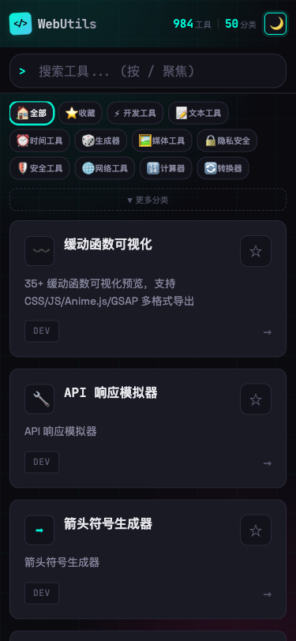

# WebUtils

<div align="center">

[](https://opensource.org/licenses/MIT)
[](https://tools.realtime-ai.chat)
[](https://github.com/chicogong/html-tools/actions/workflows/lint.yml)
[](https://github.com/chicogong/html-tools/actions/workflows/deploy.yml)
[](https://html-tools-jade.vercel.app)
[](https://htmltools-bkt.pages.dev)

[](https://github.com/chicogong/html-tools/stargazers)
[](https://github.com/chicogong/html-tools/network/members)
[](https://github.com/chicogong/html-tools/issues)
[](https://github.com/chicogong/html-tools/pulls)

### 🚀 590+ 纯前端在线工具集

**单文件 · 零构建 · 可离线 · 隐私优先 · 数据不上传**

一个完全开源、隐私至上的在线工具集。无需安装、无需注册、无广告、无追踪。

[**🌐 立即体验**](https://tools.realtime-ai.chat) | [工具列表](#工具列表-590-个) | [贡献指南](#贡献指南) | [添加新工具](#添加新工具)

</div>

---

## ✨ 为什么选择 WebUtils？

相比其他在线工具网站，WebUtils 的独特优势：

| 特性 | WebUtils | 其他工具站 |
|------|----------|-----------|
| **隐私保护** | ✅ 100% 本地处理，数据不上传 | ❌ 大多需上传到服务器 |
| **离线使用** | ✅ 下载 HTML 即可离线用 | ❌ 必须联网 |
| **无需构建** | ✅ 单文件架构，直接打开 | ❌ 需要 npm/webpack 构建 |
| **加载速度** | ✅ 极快（无框架开销） | ⚠️ 较慢（React/Vue 加载）|
| **工具数量** | ✅ 164+ 个工具 | ⚠️ 通常 50-80 个 |
| **开源免费** | ✅ MIT 协议，完全开源 | ⚠️ 部分闭源或有限制 |

## 📸 预览

<details open>
<summary><b>桌面端</b></summary>


</details>

<details>
<summary><b>移动端</b></summary>

<p align="center">
  
</p>

</details>

## 🔥 特色工具推荐

<table>
<tr>
<td width="33%">

### 🔧 开发工具
- [JSON 格式化](tools/dev/json-formatter.html) - 语法高亮，错误定位
- [正则测试器](tools/dev/regex-tester.html) - 实时匹配，捕获组展示
- [JWT 解码器](tools/dev/jwt-decoder.html) - 一键解析 Token

</td>
<td width="33%">

### ⏰ 时间工具
- [时间戳转换](tools/time/timestamp.html) - 支持多时区
- [Cron 表达式](tools/time/cron-parser.html) - 可视化解析
- [日期计算器](tools/time/date-calculator.html) - 日期推算

</td>
<td width="33%">

### 🎨 媒体工具
- [图片压缩](tools/media/image-compressor.html) - 本地压缩，不上传
- [二维码生成](tools/generator/qrcode-generator.html) - 自定义样式
- [Base64 编码](tools/dev/base64.html) - 文本/文件支持

</td>
</tr>
</table>

[**查看全部 164 个工具 ↓**](#工具列表-590-个)

---

## 在线体验

| 平台 | 链接 | 状态 |
|------|------|------|
| **🌐 自定义域名** | https://tools.realtime-ai.chat | ✅ |
| GitHub Pages | https://chicogong.github.io/html-tools/ | ✅ |
| Cloudflare Pages | https://htmltools-bkt.pages.dev | ✅ |
| Vercel | https://html-tools-jade.vercel.app | ✅ |
| Render | https://webutils-uj15.onrender.com | ✅ |
| Surge | https://webutils.surge.sh | ✅ |
| Netlify | https://localtools.netlify.app | ⏸️ 暂停 |

## 工具列表 (590 个)

### 开发工具 (61 个)

| 工具 | 描述 |
|------|------|
| [代码对比工具](tools/dev/code-diff.html) | 并排对比两段代码的差异，高亮显示变更 |
| [剪贴板查看器](tools/dev/clipboard-viewer.html) | 查看剪贴板中的各种格式数据 |
| [进制转换器](tools/dev/number-base.html) | 二进制、八进制、十进制、十六进制互转 |
| [配色方案生成器](tools/dev/color-palette.html) | 生成配色方案和调色板 |
| [颜色对比度检查器](tools/dev/contrast-checker.html) | 检查颜色对比度是否符合 WCAG 2.1 无障碍标准 |
| [颜色转换器](tools/dev/color-converter.html) | HEX、RGB、HSL 颜色格式互转，可视化调色 |
| [正则测试器](tools/dev/regex-tester.html) | 正则表达式测试，匹配高亮，捕获组展示 |
| [正则表达式速查](tools/dev/regex-cheatsheet.html) | 正则表达式语法速查表 |
| [ASCII 码表](tools/dev/ascii-table.html) | ASCII 码表速查 |
| [ASCII 艺术](tools/dev/ascii-art.html) | 将文字转换为 ASCII 艺术字体 |
| [Base64 编解码](tools/dev/base64.html) | Base64 编码与解码，支持文本和文件 |
| [Basic Auth 生成器](tools/dev/basic-auth-generator.html) | 生成 HTTP Basic Authentication 头部 |
| [Box Shadow 生成器](tools/dev/box-shadow.html) | 可视化创建 CSS box-shadow，支持多层阴影和预设样式 |
| [Chmod 计算器](tools/dev/chmod-calculator.html) | Linux 文件权限计算，支持数字和符号模式互转 |
| [Cron 生成器](tools/dev/cron-generator.html) | 可视化生成 Cron 表达式 |
| [CSS 格式化](tools/dev/css-formatter.html) | CSS 代码格式化和压缩 |
| [cURL 转换器](tools/dev/curl-converter.html) | 将 cURL 命令转换为各种编程语言代码 |
| [Emoji 选择器](tools/dev/emoji-picker.html) | 浏览和复制各种 Emoji 表情符号 |
| [Glob 模式测试](tools/dev/glob-tester.html) | Glob 模式匹配测试 |
| [Git 命令速查](tools/dev/git-cheatsheet.html) | 常用 Git 命令速查表 |
| [Hash 生成器](tools/dev/hash-generator.html) | 计算文本或文件的 MD5、SHA-1、SHA-256、SHA-512 哈希值 |
| [Hex 查看器](tools/dev/hex-viewer.html) | 以十六进制查看文件或文本内容 |
| [HMAC 生成器](tools/dev/hmac-generator.html) | 生成 HMAC 消息认证码，支持多种哈希算法 |
| [HTML 实体编解码](tools/dev/html-entity.html) | HTML 实体编码与解码，常用实体参考 |
| [HTTP 状态码参考](tools/dev/http-status.html) | HTTP 状态码速查，包含描述和使用场景 |
| [i18n Key 生成器](tools/dev/i18n-key-generator.html) | 根据文本智能生成国际化 key |
| [IP 地址转换器](tools/dev/ip-converter.html) | IP 地址格式转换，支持点分十进制、整数、二进制等 |
| [JSON → TypeScript 类型生成](tools/dev/json-typescript.html) | JSON 转 TypeScript 类型 |
| [JSON 格式化](tools/dev/json-formatter.html) | JSON 格式化、压缩、校验，支持错误定位和语法高亮 |
| [JSON 转 Go Struct](tools/dev/json-to-go.html) | JSON 转 Go Struct |
| [JSON-YAML 转换](tools/dev/json-yaml.html) | JSON 与 YAML 格式互转，支持格式化输出 |
| [JSONPath 查询](tools/dev/jsonpath-query.html) | 使用 JSONPath 表达式查询 JSON 数据 |
| [JWT 解码器](tools/dev/jwt-decoder.html) | 解码 JWT Token，查看 Header、Payload 和签名信息 |
| [Keycode 查看器](tools/dev/keycode.html) | 获取键盘按键的 KeyCode 值 |
| [MIME 类型查询](tools/dev/mime-lookup.html) | 查询文件扩展名对应的 MIME 类型 |
| [OTP 验证码生成器](tools/dev/otp-generator.html) | 生成一次性密码 (OTP/TOTP) |
| [Protobuf 解码器](tools/dev/protobuf-decoder.html) | 解码 Protobuf 二进制数据，无需 schema 定义 |
| [RSA 密钥对生成器](tools/dev/rsa-keygen.html) | 生成 RSA 公私钥对 |
| [Semver 比较器](tools/dev/semver-compare.html) | 语义化版本号比较和验证 |
| [Slug 生成器](tools/dev/slug-generator.html) | 生成 URL 友好的 slug 字符串 |
| [SQL 格式化](tools/dev/sql-formatter.html) | SQL 语句格式化和美化 |
| [TOML/YAML/JSON 转换器](tools/dev/toml-yaml-json.html) | TOML、YAML、JSON 配置格式互相转换 |
| [Unicode 查询](tools/dev/unicode-lookup.html) | Unicode 字符查询和信息 |
| [Unicode 转换器](tools/dev/unicode-converter.html) | Unicode 编解码，支持 \uXXXX、HTML 实体等格式 |
| [URL 编解码](tools/dev/url-codec.html) | URL 编码与解码，支持完整 URL 或组件 |
| [URL 解析器](tools/dev/url-parser.html) | 解析 URL 各组成部分，提取查询参数 |
| [XML 格式化](tools/dev/xml-formatter.html) | XML 格式化和验证 |
| [XML ⇄ JSON 转换](tools/dev/xml-json.html) | XML 与 JSON 格式互转 |
| [HTML 格式化](tools/dev/html-formatter.html) | HTML 代码格式化、压缩和美化 |
| [JavaScript 格式化](tools/dev/js-formatter.html) | JavaScript 代码格式化、压缩和美化 |
| [JSON Diff 对比](tools/dev/json-diff.html) | 智能对比两个 JSON 的结构和值差异 |
| [Border Radius 生成器](tools/dev/css-border-radius.html) | CSS 圆角可视化生成器 |
| [Flexbox 可视化编辑器](tools/dev/flexbox-playground.html) | 可视化调整 Flexbox 布局属性，实时预览效果 |
| [色盲模拟器](tools/dev/color-blindness.html) | 模拟不同类型色盲用户看到的颜色效果 |
| [CSS 动画生成器](tools/dev/css-animation.html) | 可视化创建 CSS 关键帧动画，一键生成代码 |
| [.gitignore 生成器](tools/dev/gitignore-generator.html) | 选择编程语言和框架，快速生成 .gitignore 文件 |
| [Punycode 转换器](tools/dev/punycode.html) | 国际化域名 (IDN) 与 Punycode 编码互转 |
| [字符集转换器](tools/dev/charset-converter.html) | 文本编码转换，支持 UTF-8/16、Hex、URL 编码等格式 |
| [HTML 模板生成器](tools/dev/html-template.html) | 生成 HTML5 页面模板，支持多种布局和 CSS 框架 |
| [README 生成器](tools/dev/readme-generator.html) | 快速生成项目 README.md，支持徽章、特性、安装说明等 |
| [License 生成器](tools/dev/license-generator.html) | 生成开源许可证文件，支持 MIT、Apache、GPL 等协议 |

### 文本工具 (23 个)

| 工具 | 描述 |
|------|------|
| [空白字符清理](tools/text/whitespace-cleaner.html) | 清理多余空白、空行、行首尾空格 |
| [罗马数字转换器](tools/text/roman-numeral.html) | 罗马数字转换 |
| [摩尔斯电码](tools/text/morse-code.html) | 文本与摩尔斯电码互转，支持音频播放 |
| [盘古之白](tools/text/pangu-spacing.html) | 自动在中英文之间添加空格，优化排版 |
| [文本 Diff](tools/text/text-diff.html) | 文本差异对比，左右并排显示，行内差异高亮 |
| [文本大小写转换](tools/text/case-converter.html) | 文本大小写转换 |
| [文本加密/解密](tools/text/text-cipher.html) | 多种古典加密算法：凯撒、ROT13、栅栏等 |
| [文本排序](tools/text/text-sort.html) | 按字母、数字、长度等方式排序文本行 |
| [文本去重](tools/text/text-dedup.html) | 去除重复行，支持保持顺序和忽略大小写 |
| [文本随机化工具](tools/text/text-randomizer.html) | 文本随机打乱 |
| [文本统计增强版](tools/text/text-stats.html) | 文本统计分析 |
| [行排序工具](tools/text/line-sorter.html) | 按字母、数字或自定义规则排序文本行 |
| [字符串转义](tools/text/string-escape.html) | 字符串转义和反转义 |
| [字数统计](tools/text/word-counter.html) | 统计字符、单词、句子、段落数量 |
| [CSV ⇄ JSON 转换](tools/text/csv-json.html) | CSV 与 JSON 互转 |
| [Lorem Ipsum 生成器](tools/text/lorem-ipsum.html) | 生成占位文本，支持段落、句子、单词模式 |
| [Markdown 预览](tools/text/markdown-preview.html) | 实时 Markdown 预览，支持 GFM 语法，可导出 HTML |
| [NATO 字母表](tools/text/nato-alphabet.html) | NATO 音标字母表转换 |
| [Slugify 工具](tools/text/slugify.html) | 生成 URL slug |
| [HTML ⇄ Markdown 转换](tools/text/html-markdown.html) | HTML 与 Markdown 双向转换，支持表格、代码块、链接等 |
| [Markdown 表格生成器](tools/text/markdown-table.html) | 可视化编辑 Markdown 表格，支持导入 CSV 数据 |
| [文本对比增强版](tools/text/text-compare.html) | 增强版文本对比，支持分栏/统一视图，忽略大小写和空白 |
| [文本模板填充器](tools/text/template-filler.html) | 文本模板变量填充，支持批量生成和 CSV 导入 |

### 时间工具 (9 个)

| 工具 | 描述 |
|------|------|
| [倒计时器](tools/time/countdown.html) | 设定倒计时或目标日期倒数，支持通知提醒 |
| [工时计算器](tools/time/work-hours.html) | 计算工作时长、加班时间和薪资估算 |
| [年龄计算器](tools/time/age-calculator.html) | 根据生日计算精确年龄、星座、生肖等信息 |
| [日期计算器](tools/time/date-calculator.html) | 计算日期差异、日期推算、工作日统计 |
| [时间戳转换](tools/time/timestamp.html) | 时间戳与日期互转，支持多种格式和时区 |
| [时区转换器](tools/time/timezone-converter.html) | 在不同时区之间转换时间 |
| [世界时钟](tools/time/world-clock.html) | 世界时钟 |
| [Cron 表达式解析](tools/time/cron-parser.html) | 解析 Cron 表达式，展示可读描述和下次执行时间 |
| [秒表计时器](tools/time/stopwatch.html) | 在线秒表，支持计次、暂停、毫秒精度显示 |

### 生成器 (14 个)

| 工具 | 描述 |
|------|------|
| [二维码生成器](tools/generator/qrcode-generator.html) | 生成自定义颜色和大小的二维码 |
| [假数据生成器](tools/generator/fake-data.html) | 生成测试用的假数据：姓名、邮箱、地址、电话等 |
| [密码生成器](tools/generator/password-generator.html) | 生成安全随机密码，支持自定义长度和字符类型 |
| [随机数生成器](tools/generator/random-number.html) | 随机数生成器 |
| [条形码生成器](tools/generator/barcode.html) | 生成多种格式条形码：Code128、EAN、UPC 等 |
| [头像生成器](tools/generator/avatar.html) | 生成多种风格的头像：首字母、像素、Identicon 等 |
| [占位图生成器](tools/generator/placeholder-image.html) | 生成自定义尺寸、颜色、文字的占位图片 |
| [CSS 渐变生成器](tools/generator/gradient-css.html) | 可视化创建 CSS 渐变，支持线性、径向和锥形渐变 |
| [Mock 数据生成器](tools/generator/mock-data.html) | 生成模拟测试数据 |
| [NanoID 生成器](tools/generator/nanoid-generator.html) | 生成紧凑的 URL 安全短 ID，可自定义长度和字符集 |
| [Open Graph 预览器](tools/generator/og-preview.html) | Open Graph 预览 |
| [UUID/ULID 生成器](tools/generator/uuid-generator.html) | 生成 UUID v4/v7 和 ULID，支持批量生成 |
| [WiFi 二维码生成器](tools/generator/wifi-qrcode.html) | WiFi 二维码生成 |
| [二维码扫描器](tools/generator/qrcode-scanner.html) | 在线二维码扫描器，支持摄像头扫描和图片上传 |

### 媒体工具 (16 个)

| 工具 | 描述 |
|------|------|
| [摄像头拍照](tools/media/camera-demo.html) | 调用摄像头拍照并保存到本地 |
| [图片裁剪](tools/media/image-crop.html) | 在线裁剪图片，支持自由裁剪和预设比例 |
| [图片格式批量转换](tools/media/image-format-converter.html) | 批量转换图片格式，支持 PNG/JPG/WebP/AVIF |
| [图片水印](tools/media/image-watermark.html) | 为图片添加文字或图片水印，支持平铺 |
| [图片压缩](tools/media/image-compressor.html) | 本地图片压缩，支持调整质量、尺寸和格式转换 |
| [图片压缩对比](tools/media/image-resize.html) | 比较不同质量设置下的图片压缩效果 |
| [图片转 ASCII 艺术](tools/media/image-to-ascii.html) | 图片转 ASCII 字符画 |
| [文字转语音](tools/media/text-to-speech.html) | 使用 Web Speech API 将文字转为语音朗读 |
| [音频可视化器](tools/media/audio-visualizer.html) | 音频频谱可视化，支持波形、柱状等多种显示模式 |
| [Base64 图片转换](tools/media/base64-image.html) | 图片与 Base64 编码互转，支持多种格式 |
| [EXIF 信息查看](tools/media/exif-viewer.html) | 查看图片的 EXIF 元数据和拍摄信息 |
| [Favicon 生成器](tools/media/favicon-generator.html) | 从文字或图片生成多尺寸 Favicon 图标 |
| [ICO 图标查看器](tools/media/ico-viewer.html) | 查看和提取 ICO 文件中的所有图标尺寸 |
| [SVG 渲染器](tools/media/svg-render.html) | 将 SVG 代码渲染为 PNG/JPEG 图片 |
| [SVG 占位图生成器](tools/media/svg-placeholder.html) | SVG 占位图生成 |
| [截图美化工具](tools/media/screenshot-beautifier.html) | 给截图添加精美背景、阴影和圆角，一键生成分享图片 |

### 隐私安全 (8 个)

| 工具 | 描述 |
|------|------|
| [密码强度检测](tools/privacy/password-strength.html) | 检测密码强度，分析安全性和破解时间估算 |
| [日志脱敏](tools/privacy/log-masker.html) | 自动识别并脱敏日志中的 IP、邮箱、手机号等敏感信息 |
| [随机密钥生成器](tools/privacy/random-key.html) | 随机密钥生成 |
| [随机身份生成](tools/privacy/random-identity.html) | 生成随机假身份信息用于测试和隐私保护 |
| [文件哈希校验](tools/privacy/file-hash.html) | 计算文件的 MD5、SHA-1、SHA-256 哈希值 |
| [信用卡验证器](tools/privacy/credit-card.html) | 信用卡号验证 |
| [AES 加密解密](tools/privacy/encrypt-decrypt.html) | 使用 AES-GCM 算法进行文本加密和解密 |
| [RSA 加密解密](tools/privacy/rsa-tool.html) | RSA 加密解密 |

### 安全工具 (1 个)

| 工具 | 描述 |
|------|------|
| [URL安全化](tools/security/url-defang.html) | URL 脱敏处理 |

### 网络工具 (7 个)

| 工具 | 描述 |
|------|------|
| [端口查询器](tools/network/port-lookup.html) | 常用端口号速查，包含服务名称和协议说明 |
| [HTTP 头解析器](tools/network/http-header-parser.html) | HTTP 请求头解析 |
| [IP 地址工具](tools/network/ip-tools.html) | IP 地址工具集 |
| [IP 子网计算器](tools/network/subnet-calculator.html) | 计算 CIDR 子网范围、可用 IP 数量和掩码转换 |
| [MAC 地址查询](tools/network/mac-lookup.html) | 查询 MAC 地址对应的设备厂商信息 |
| [User Agent 解析器](tools/network/user-agent.html) | User-Agent 检测 |
| [设备信息](tools/network/device-info.html) | 查看设备、浏览器和系统的详细信息 |

### 计算器 (9 个)

| 工具 | 描述 |
|------|------|
| [百分比计算器](tools/calculator/percentage.html) | 多种百分比计算模式：求百分比、增减、占比等 |
| [存储单位换算](tools/calculator/storage-converter.html) | B/KB/MB/GB/TB/PB 存储单位互转 |
| [进度计算器](tools/calculator/progress.html) | 计算项目进度百分比和预计完成时间 |
| [宽高比计算器](tools/calculator/aspect-ratio.html) | 计算屏幕/图片宽高比，支持常见比例换算 |
| [位运算计算器](tools/calculator/bitwise-calculator.html) | 位运算计算器 |
| [数学表达式计算器](tools/calculator/math-evaluator.html) | 计算复杂数学表达式，支持函数和常量 |
| [BMI 计算器](tools/calculator/bmi-calculator.html) | 计算身体质量指数，评估体重健康状况 |
| [贷款计算器](tools/calculator/loan-calculator.html) | 计算贷款月供、总利息，支持两种还款方式 |
| [进制计算器](tools/calculator/base-calculator.html) | 多进制转换和位运算计算器，支持可视化位操作 |

### 转换器 (5 个)

| 工具 | 描述 |
|------|------|
| [单位转换器](tools/converter/unit-converter.html) | 长度、重量、温度、面积等多种单位换算 |
| [文件大小计算器](tools/converter/file-size.html) | 文件大小单位转换 |
| [JSON ⇄ YAML 转换](tools/converter/json-yaml.html) | JSON 和 YAML 双向转换，支持格式化和压缩 |
| [CSV ⇄ JSON 转换](tools/converter/csv-json.html) | CSV 和 JSON 双向转换，支持表格预览 |
| [cURL to Code](tools/converter/curl-to-code.html) | 将 cURL 命令转换为多种编程语言代码 |

### 提取器 (3 个)

| 工具 | 描述 |
|------|------|
| [链接提取器](tools/extractor/link-extractor.html) | 从文本提取链接 |
| [文本信息提取器](tools/extractor/text-extractor.html) | 提取文本中的特定内容 |
| [正则提取器](tools/extractor/regex-extractor.html) | 使用正则表达式批量提取文本内容，支持导出 CSV |

### AI 工具 (5 个)

| 工具 | 描述 |
|------|------|
| [Prompt 模板库](tools/ai/prompt-templates.html) | AI 提示词模板库 |
| [Token 计数器](tools/ai/token-counter.html) | 估算 AI 模型 Token 数量 |
| [Claude Skills 精选](tools/ai/claude-skills.html) | Anthropic 官方 Skills 集合，提升 Claude 特定任务表现 |
| [MCP 配置指南](tools/ai/mcp-guide.html) | Model Context Protocol 配置教程与热门服务器 |
| [MCP 客户端大全](tools/ai/mcp-clients.html) | 支持 MCP 的 AI 客户端、IDE 和开发工具汇总 |


## SEO 与搜索引擎收录

本项目已提交到多个搜索引擎站长平台，方便被搜索引擎收录。

### 已提交平台

| 平台 | 状态 | 验证文件/方式 |
|------|------|--------------|
| Google Search Console | ✅ 已验证 | DNS 验证 |
| Bing Webmaster | ✅ 已验证 | `BingSiteAuth.xml` |
| 头条搜索站长平台 | ✅ 已验证 | `ByteDanceVerify.html` + meta tag |
| 百度资源平台 | ✅ 已验证 | meta tag |
| 搜狗资源平台 | ✅ 已验证 | `sogousiteverification.txt` |
| IndexNow | ✅ 已配置 | `03bdae3721054dfba79edd66e6157c3f.txt` |

### SEO 相关文件

| 文件 | 用途 |
|------|------|
| `sitemap.xml` | 站点地图，包含所有工具页面 (150 URLs) |
| `robots.txt` | 搜索引擎爬虫规则 |
| `llms.txt` | AI/LLM 友好的网站描述 |
| `index.html` | 含 Schema.org 结构化数据 (WebApplication, FAQPage, WebSite) |
| `manifest.json` | PWA 配置文件，支持应用安装 |
| `favicon.svg` | 矢量品牌图标 (3×3 网格设计) |
| `favicon-16x16.png` | 浏览器标签页图标 |
| `favicon-32x32.png` | 高清浏览器图标 |
| `apple-touch-icon.png` | iOS/macOS 主屏幕图标 (180×180) |

### SEO 优化特性 (2025-12-27)

- ✅ **Favicon & 品牌识别**: 简约 3×3 网格设计,多尺寸支持
- ✅ **PWA 支持**: 可安装为原生应用,4 个快捷方式到常用工具
- ✅ **结构化数据**:
  - WebApplication Schema (详细应用信息)
  - FAQPage Schema (8 个常见问题)
  - WebSite Schema (站内搜索功能)
  - BreadcrumbList Schema (工具页面面包屑导航)
- ✅ **性能优化**: 字体 preload + async 加载,无渲染阻塞
- ✅ **Open Graph**: 完整社交媒体预览支持 (Twitter, Facebook, LinkedIn)
- ✅ **移动优化**: viewport meta, touch icons, PWA installable

**预计 Lighthouse 评分**: SEO 98/100 | Performance 90/100 | Accessibility 95/100

## 使用方式

### 在线使用

访问 GitHub Pages: https://chicogong.github.io/html-tools/

### 本地使用

1. Clone 仓库或下载单个 HTML 文件
2. 直接在浏览器中打开即可使用

```bash
git clone https://github.com/chicogong/html-tools.git
cd html-tools
open index.html  # macOS
# 或者
start index.html  # Windows
```

### 部署到 GitHub Pages

1. Fork 本仓库
2. 进入 Settings → Pages
3. Source 选择 "GitHub Actions"
4. 等待 CI 运行完成后即可访问 `https://你的用户名.github.io/html-tools/`

### 部署到其他平台

本项目已配置支持多平台部署：

- **Vercel**: 直接导入 GitHub 仓库即可
- **Netlify**: 直接导入 GitHub 仓库即可
- **Cloudflare Pages**: 直接连接 GitHub 仓库即可

配置文件：
- `vercel.json` - Vercel 配置
- `netlify.toml` - Netlify 配置
- `_headers` / `_redirects` - Cloudflare Pages 配置

## 通用功能

每个工具都支持以下功能：

- **粘贴**: 从剪贴板粘贴内容
- **复制输出**: 将处理结果复制到剪贴板
- **分享链接**: 生成包含当前输入内容的 URL，方便分享
- **清空**: 清空输入输出并重置状态
- **自动保存**: 输入内容自动保存到 URL hash，防止意外丢失

## 技术栈

- 纯 HTML/CSS/JavaScript
- Web APIs:
  - Web Crypto API - 加密功能 (AES-GCM, RSA, HMAC)
  - Web Speech API - 语音合成
  - Web Audio API - 音频可视化
  - Canvas API - 图片生成
- CDN 依赖：
  - [js-yaml](https://github.com/nodeca/js-yaml) - YAML 解析
  - [jsdiff](https://github.com/kpdecker/jsdiff) - 文本 Diff
  - [marked](https://github.com/markedjs/marked) - Markdown 渲染
  - [DOMPurify](https://github.com/cure53/DOMPurify) - XSS 防护
  - [QRCode.js](https://github.com/soldair/node-qrcode) - 二维码生成
  - [JsBarcode](https://github.com/lindell/JsBarcode) - 条形码生成
  - [@iarna/toml](https://github.com/iarna/iarna-toml) - TOML 解析

## 开发

### 环境准备

```bash
# Clone 仓库
git clone https://github.com/chicogong/html-tools.git
cd html-tools

# 安装依赖（仅用于 lint）
npm install
```

### 本地预览

无需任何构建步骤，直接用浏览器打开 HTML 文件即可：

```bash
# macOS
open index.html

# Windows
start index.html

# Linux
xdg-open index.html

# 或使用任意静态服务器
npx serve .
python -m http.server 8000
```

### Lint 检查

```bash
# 运行全部检查
npm run lint

# 单独检查
npm run lint:html  # HTMLHint
npm run lint:css   # Stylelint
npm run lint:js    # ESLint
```

### 工具同步

工具列表使用 `tools.json` 作为唯一数据源，通过同步脚本更新 `index.html`：

```bash
# 同步 tools.json 到 index.html
npm run sync:tools
```

CI 会自动检查同步状态，如果 `tools.json` 和 `index.html` 不一致，构建会失败。

### 添加新工具

1. 在 `tools/` 下选择合适的分类目录（dev/text/time/generator/privacy/media/security/network/calculator/extractor/ai）
2. 创建新的 HTML 文件，遵循单文件模式
3. 在 `tools.json` 中添加工具元数据：
   ```json
   {
     "path": "tools/<category>/<file>.html",
     "name": "工具名称",
     "category": "<category>",
     "keywords": "关键词1 关键词2 keyword"
   }
   ```
4. 运行 `npm run sync:tools` 同步到 index.html
5. 更新 `README.md` 工具列表
6. 运行 `npm run lint` 确保代码规范
7. 提交更改（CI 会检查同步状态）

### 工具模板

每个工具应遵循以下模式：

```html
<!DOCTYPE html>
<html lang="zh">
<head>
  <meta charset="utf-8">
  <meta name="viewport" content="width=device-width, initial-scale=1">
  <title>工具名称 - HTML Tools</title>
  <style>
    /* 内联 CSS */
  </style>
</head>
<body>
  <!-- HTML 结构 -->
  
  <script>
    // 内联 JavaScript
    
    // URL 状态持久化
    function saveState() {
      const state = { /* 状态数据 */ };
      history.replaceState(null, '', '#' + btoa(JSON.stringify(state)));
    }
    
    function loadState() {
      try {
        const hash = location.hash.slice(1);
        if (hash) return JSON.parse(atob(hash));
      } catch (e) {}
      return null;
    }
  </script>
</body>
</html>
```

关键原则：
- **单文件**: JS/CSS 全部内联，不依赖外部文件
- **CDN 依赖**: 如需第三方库，使用 CDN（推荐 cdnjs/unpkg/jsdelivr）
- **URL 状态**: 支持通过 URL hash 保存和恢复状态
- **纯前端**: 所有处理在浏览器完成，不上传数据
- **响应式**: 支持移动端和桌面端
- **深色模式**: 支持明暗主题切换

## 贡献指南

欢迎贡献新工具或改进现有工具！

### 贡献方式

1. **报告 Bug**: 在 [Issues](https://github.com/chicogong/html-tools/issues) 中描述问题
2. **建议功能**: 在 Issues 中提出新工具或功能建议
3. **提交代码**: Fork 仓库，创建分支，提交 PR

### 提交 PR

```bash
# Fork 并 clone 你的仓库
git clone https://github.com/你的用户名/html-tools.git
cd html-tools

# 创建功能分支
git checkout -b feature/new-tool

# 开发并测试
# ...

# 运行 lint 检查
npm run lint

# 提交代码
git add .
git commit -m "feat: add xxx tool"

# 推送到你的仓库
git push origin feature/new-tool

# 在 GitHub 上创建 Pull Request
```

### Commit 规范

使用 [Conventional Commits](https://www.conventionalcommits.org/) 格式：

- `feat: 新功能`
- `fix: Bug 修复`
- `docs: 文档更新`
- `style: 代码格式（不影响功能）`
- `refactor: 重构`
- `perf: 性能优化`
- `test: 测试相关`
- `chore: 构建/工具链`

### 代码规范

- HTML: 遵循 HTMLHint 规则
- CSS: 遵循 Stylelint 规则
- JS: 遵循 ESLint 规则
- 使用 2 空格缩进
- 中文注释，英文代码

## CI/CD

- **Lint**: 每次 PR 自动运行 HTMLHint + Stylelint + ESLint
- **Tools Sync Check**: CI 检查 tools.json 与 index.html 是否同步
- **Deploy**: 每次推送到 master 自动部署到 GitHub Pages
- **Release**: 推送 tag 自动创建 Release
- **Dependabot**: 自动检查依赖更新

## 灵感来源

本项目受 [Simon Willison](https://simonwillison.net/) 的 [tools.simonwillison.net](https://tools.simonwillison.net/) 和他的博客文章 [Useful patterns for building HTML tools](https://simonwillison.net/2025/Jan/13/useful-patterns-for-html-tools/) 启发。

## License

[MIT](LICENSE)
