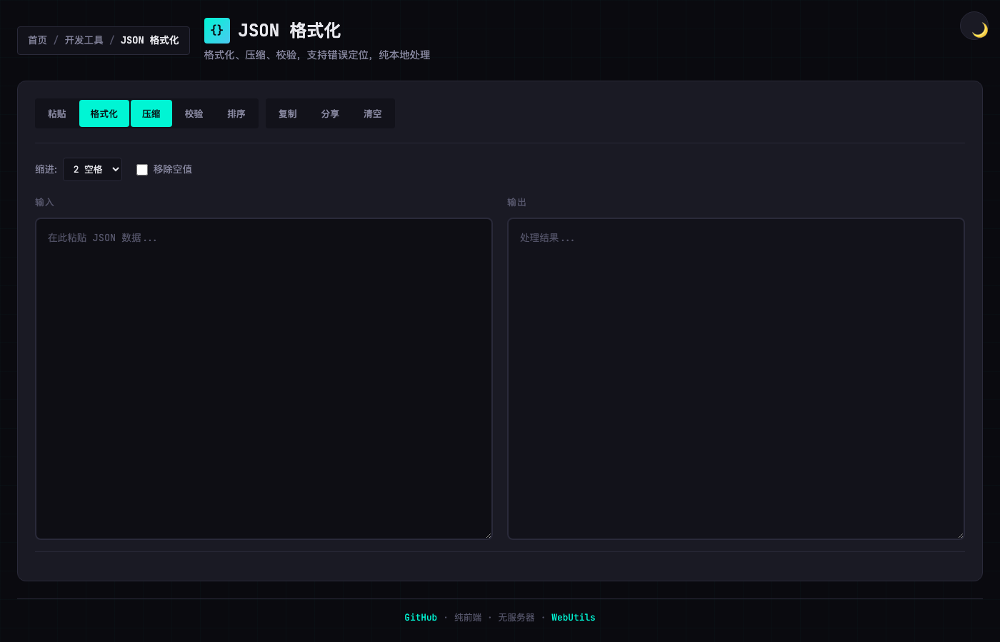

# HTML Tools

[](https://opensource.org/licenses/MIT)
[](https://github.com/chicogong/html-tools/actions/workflows/lint.yml)
[](https://github.com/chicogong/html-tools/actions/workflows/deploy.yml)
[](https://chicogong.github.io/html-tools/)
[](https://tinytools.vercel.app)
[](https://localtools.netlify.app)
[](https://tools.realtime-ai.chat)

[](https://github.com/chicogong/html-tools/commits/master)
[](https://github.com/chicogong/html-tools/stargazers)
[](https://github.com/chicogong/html-tools/network/members)
[](https://github.com/chicogong/html-tools/issues)
[](https://github.com/chicogong/html-tools)


> 纯前端工具集 - 单文件、零构建、可离线使用 | Pure HTML Tools - Single file, Zero build, Offline-ready

## 截图




## 特点

- **单文件**: 每个工具都是一个独立的 HTML 文件，JS/CSS 全部内联
- **零构建**: 无需 npm、webpack 或任何构建步骤，直接复制粘贴即可使用
- **纯前端**: 所有处理都在浏览器本地完成，不上传任何数据到服务器
- **可分享**: 支持通过 URL 分享当前状态
- **离线友好**: 下载 HTML 文件后可完全离线使用

## 在线体验

| 平台 | 链接 |
|------|------|
| **自定义域名** | https://tools.realtime-ai.chat |
| GitHub Pages | https://chicogong.github.io/html-tools/ |
| Cloudflare Pages | https://htmltools-bkt.pages.dev |
| Vercel | https://tinytools.vercel.app |
| Netlify | https://localtools.netlify.app |

## 工具列表

### 开发工具

| 工具 | 描述 |
|------|------|
| [JSON 格式化](tools/dev/json-formatter.html) | JSON 格式化、压缩、校验，支持错误定位和统计 |
| [JSON-YAML 转换](tools/dev/json-yaml.html) | JSON 与 YAML 格式互转，支持格式化输出 |
| [JWT 解码器](tools/dev/jwt-decoder.html) | 解码 JWT Token，查看 Header、Payload 和签名信息 |
| [Base64 编解码](tools/dev/base64.html) | Base64 编码与解码，支持文本和文件 |
| [URL 编解码](tools/dev/url-codec.html) | URL 编码与解码，支持完整 URL 或组件编码 |
| [正则测试器](tools/dev/regex-tester.html) | 正则表达式测试，匹配高亮，捕获组展示 |
| [剪贴板查看器](tools/dev/clipboard-viewer.html) | 查看剪贴板中的各种格式数据 |
| [Hash 生成器](tools/dev/hash-generator.html) | 计算 MD5、SHA-1、SHA-256、SHA-512 哈希值 |
| [颜色转换器](tools/dev/color-converter.html) | HEX、RGB、HSL 颜色格式互转 |
| [HTML 实体编解码](tools/dev/html-entity.html) | HTML 实体编码与解码，常用实体参考 |
| [进制转换器](tools/dev/number-base.html) | 二进制、八进制、十进制、十六进制互转 |

### 文本工具

| 工具 | 描述 |
|------|------|
| [文本 Diff](tools/text/text-diff.html) | 文本差异对比，高亮显示增删改内容 |
| [Markdown 预览](tools/text/markdown-preview.html) | 实时 Markdown 预览，支持 GFM 语法，可导出 HTML |
| [字数统计](tools/text/word-counter.html) | 统计字符、单词、句子、段落数量，支持目标字数进度追踪 |
| [Lorem Ipsum 生成器](tools/text/lorem-ipsum.html) | 生成占位文本，支持段落、句子、单词模式 |

### 时间工具

| 工具 | 描述 |
|------|------|
| [时间戳转换](tools/time/timestamp.html) | 时间戳与日期互转，支持多种格式和时区 |
| [时间戳转换器](tools/time/timestamp-converter.html) | Unix 时间戳与日期时间互转，支持秒和毫秒格式 |
| [时区转换器](tools/time/timezone-converter.html) | 在不同时区之间转换时间，方便跨时区协作 |
| [日期计算器](tools/time/date-calculator.html) | 计算日期差异、日期推算、工作日统计 |
| [Cron 表达式解析](tools/time/cron-parser.html) | 解析 Cron 表达式，展示可读描述和下次执行时间 |

### 生成器

| 工具 | 描述 |
|------|------|
| [UUID/ULID 生成器](tools/generator/uuid-generator.html) | 生成 UUID v4/v7 和 ULID，支持批量生成 |
| [二维码生成器](tools/generator/qrcode-generator.html) | 生成自定义颜色和大小的二维码，支持下载 PNG |
| [密码生成器](tools/generator/password-generator.html) | 生成安全随机密码，支持自定义长度和字符类型 |

### 隐私工具

| 工具 | 描述 |
|------|------|
| [日志脱敏](tools/privacy/log-masker.html) | 自动识别并脱敏 IP、邮箱、手机号等敏感信息 |

### 媒体工具

| 工具 | 描述 |
|------|------|
| [图片压缩](tools/media/image-compressor.html) | 本地图片压缩，支持调整质量、尺寸和格式转换 |
| [图片压缩对比](tools/media/image-resize.html) | 比较不同质量设置下的图片压缩效果，找到最佳平衡点 |
| [SVG 渲染器](tools/media/svg-render.html) | 将 SVG 代码渲染为 PNG/JPEG 图片，支持自定义尺寸和背景 |
| [摄像头拍照](tools/media/camera-demo.html) | 调用摄像头拍照并保存到本地 |

## 使用方式

### 在线使用

访问 GitHub Pages: https://chicogong.github.io/html-tools/

### 本地使用

1. Clone 仓库或下载单个 HTML 文件
2. 直接在浏览器中打开即可使用

```bash
git clone https://github.com/chicogong/html-tools.git
cd html-tools
open index.html  # macOS
# 或者
start index.html  # Windows
```

### 部署到 GitHub Pages

1. Fork 本仓库
2. 进入 Settings → Pages
3. Source 选择 "GitHub Actions"
4. 等待 CI 运行完成后即可访问 `https://你的用户名.github.io/html-tools/`

### 部署到其他平台

本项目已配置支持多平台部署：

- **Vercel**: 直接导入 GitHub 仓库即可
- **Netlify**: 直接导入 GitHub 仓库即可
- **Cloudflare Pages**: 直接连接 GitHub 仓库即可

配置文件：
- `vercel.json` - Vercel 配置
- `netlify.toml` - Netlify 配置
- `_headers` / `_redirects` - Cloudflare Pages 配置

## 通用功能

每个工具都支持以下功能：

- **粘贴**: 从剪贴板粘贴内容
- **复制输出**: 将处理结果复制到剪贴板
- **分享链接**: 生成包含当前输入内容的 URL，方便分享
- **清空**: 清空输入输出并重置状态
- **自动保存**: 输入内容自动保存到 URL hash，防止意外丢失

## 技术栈

- 纯 HTML/CSS/JavaScript
- CDN 依赖：
  - [js-yaml](https://github.com/nodeca/js-yaml) - YAML 解析
  - [jsdiff](https://github.com/kpdecker/jsdiff) - 文本 Diff
  - [marked](https://github.com/markedjs/marked) - Markdown 渲染
  - [DOMPurify](https://github.com/cure53/DOMPurify) - XSS 防护
  - [QRCode.js](https://github.com/soldair/node-qrcode) - 二维码生成

## 开发

### 环境准备

```bash
# Clone 仓库
git clone https://github.com/chicogong/html-tools.git
cd html-tools

# 安装依赖（仅用于 lint）
npm install
```

### 本地预览

无需任何构建步骤，直接用浏览器打开 HTML 文件即可：

```bash
# macOS
open index.html

# Windows
start index.html

# Linux
xdg-open index.html

# 或使用任意静态服务器
npx serve .
python -m http.server 8000
```

### Lint 检查

```bash
# 运行全部检查
npm run lint

# 单独检查
npm run lint:html  # HTMLHint
npm run lint:css   # Stylelint
npm run lint:js    # ESLint
```

### 添加新工具

1. 在 `tools/` 下选择合适的分类目录（dev/text/time/generator/privacy/media）
2. 创建新的 HTML 文件，遵循单文件模式
3. 更新 `index.html` 添加工具卡片
4. 更新 `README.md` 工具列表
5. 运行 `npm run lint` 确保代码规范

### 工具模板

每个工具应遵循以下模式：

```html
<!DOCTYPE html>
<html lang="zh">
<head>
  <meta charset="utf-8">
  <meta name="viewport" content="width=device-width, initial-scale=1">
  <title>工具名称 - HTML Tools</title>
  <style>
    /* 内联 CSS */
  </style>
</head>
<body>
  <!-- HTML 结构 -->
  
  <script>
    // 内联 JavaScript
    
    // URL 状态持久化
    function saveState() {
      const state = { /* 状态数据 */ };
      history.replaceState(null, '', '#' + btoa(JSON.stringify(state)));
    }
    
    function loadState() {
      try {
        const hash = location.hash.slice(1);
        if (hash) return JSON.parse(atob(hash));
      } catch (e) {}
      return null;
    }
  </script>
</body>
</html>
```

关键原则：
- **单文件**: JS/CSS 全部内联，不依赖外部文件
- **CDN 依赖**: 如需第三方库，使用 CDN（推荐 cdnjs/unpkg/jsdelivr）
- **URL 状态**: 支持通过 URL hash 保存和恢复状态
- **纯前端**: 所有处理在浏览器完成，不上传数据
- **响应式**: 支持移动端和桌面端
- **深色模式**: 支持明暗主题切换

## 贡献指南

欢迎贡献新工具或改进现有工具！

### 贡献方式

1. **报告 Bug**: 在 [Issues](https://github.com/chicogong/html-tools/issues) 中描述问题
2. **建议功能**: 在 Issues 中提出新工具或功能建议
3. **提交代码**: Fork 仓库，创建分支，提交 PR

### 提交 PR

```bash
# Fork 并 clone 你的仓库
git clone https://github.com/你的用户名/html-tools.git
cd html-tools

# 创建功能分支
git checkout -b feature/new-tool

# 开发并测试
# ...

# 运行 lint 检查
npm run lint

# 提交代码
git add .
git commit -m "feat: add xxx tool"

# 推送到你的仓库
git push origin feature/new-tool

# 在 GitHub 上创建 Pull Request
```

### Commit 规范

使用 [Conventional Commits](https://www.conventionalcommits.org/) 格式：

- `feat: 新功能`
- `fix: Bug 修复`
- `docs: 文档更新`
- `style: 代码格式（不影响功能）`
- `refactor: 重构`
- `perf: 性能优化`
- `test: 测试相关`
- `chore: 构建/工具链`

### 代码规范

- HTML: 遵循 HTMLHint 规则
- CSS: 遵循 Stylelint 规则
- JS: 遵循 ESLint 规则
- 使用 2 空格缩进
- 中文注释，英文代码

## CI/CD

- **Lint**: 每次 PR 自动运行 HTMLHint + Stylelint + ESLint
- **Deploy**: 每次推送到 master 自动部署到 GitHub Pages
- **Release**: 推送 tag 自动创建 Release
- **Dependabot**: 自动检查依赖更新

## 灵感来源

本项目受 [Simon Willison](https://simonwillison.net/) 的 [tools.simonwillison.net](https://tools.simonwillison.net/) 和他的博客文章 [Useful patterns for building HTML tools](https://simonwillison.net/2025/Jan/13/useful-patterns-for-html-tools/) 启发。

## License

[MIT](LICENSE)
